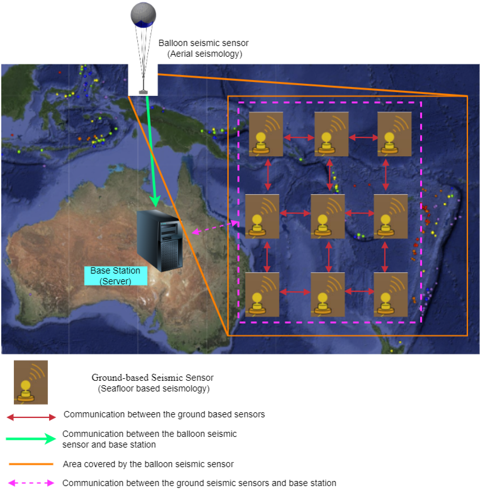
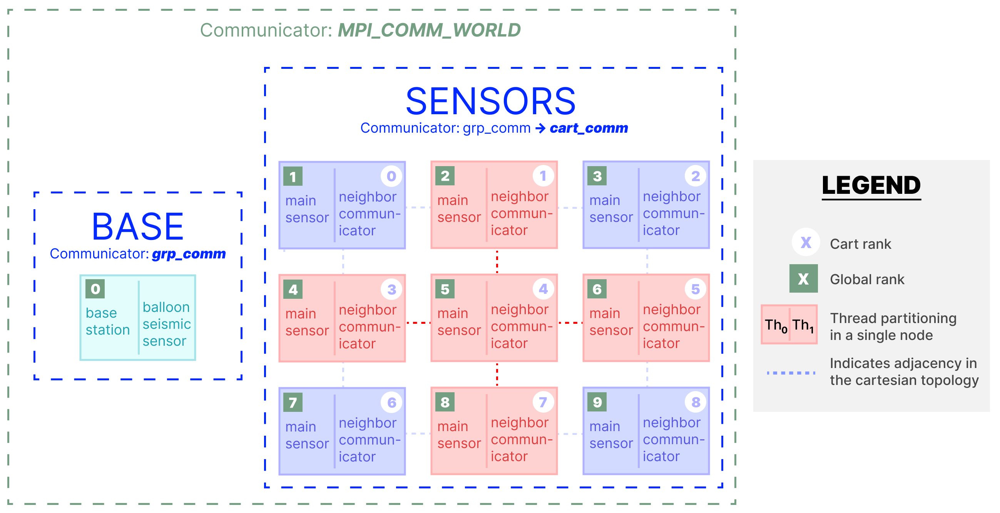
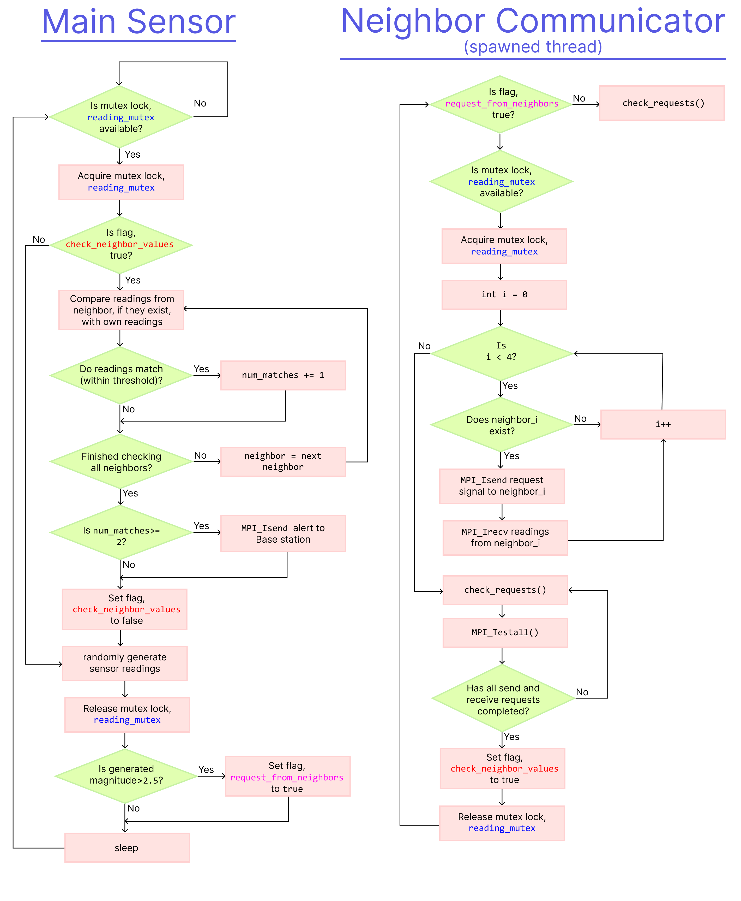
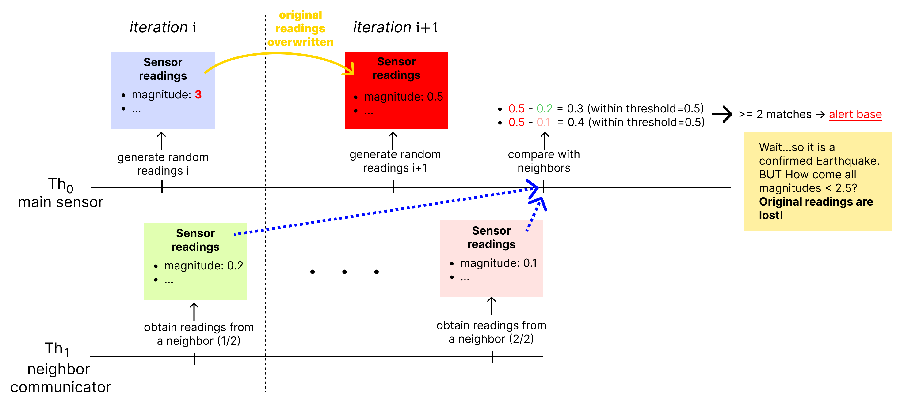
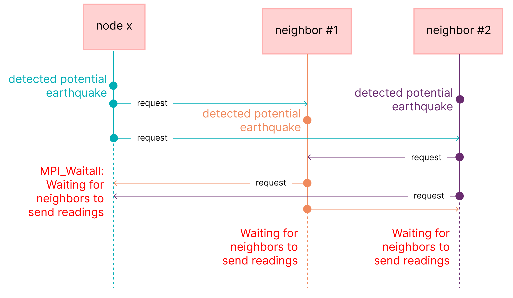
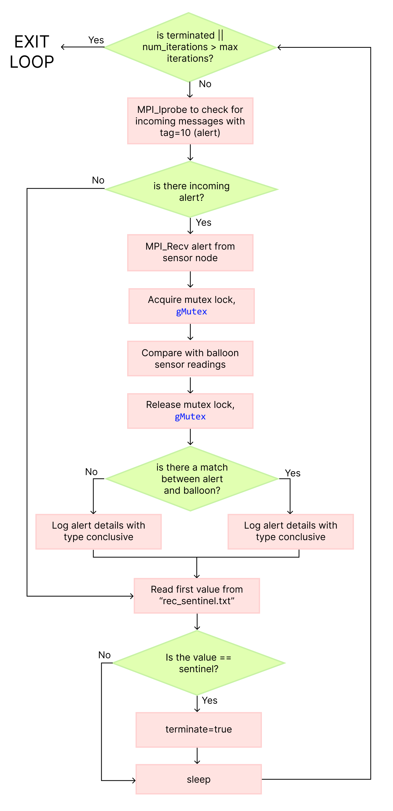
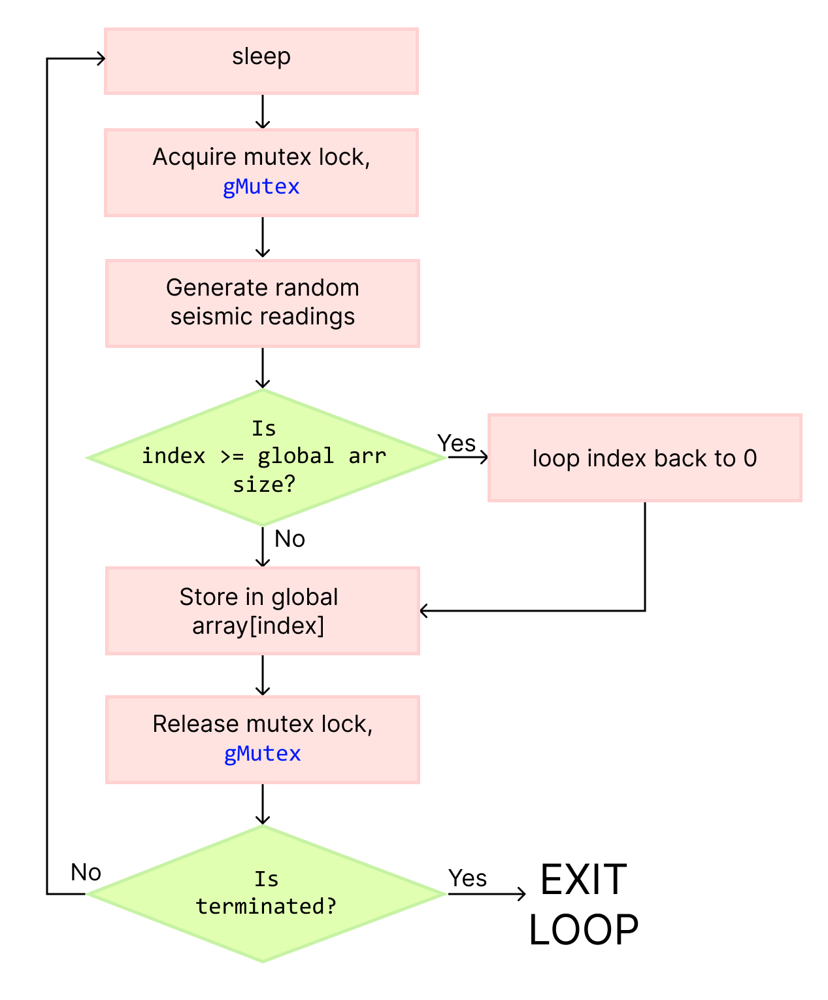
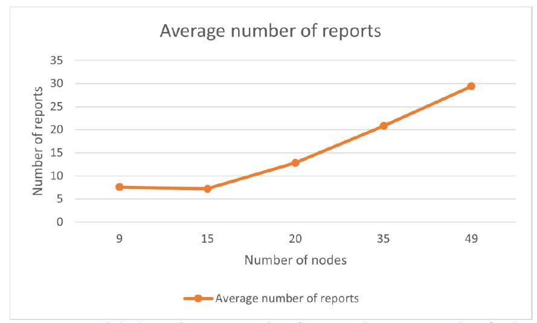
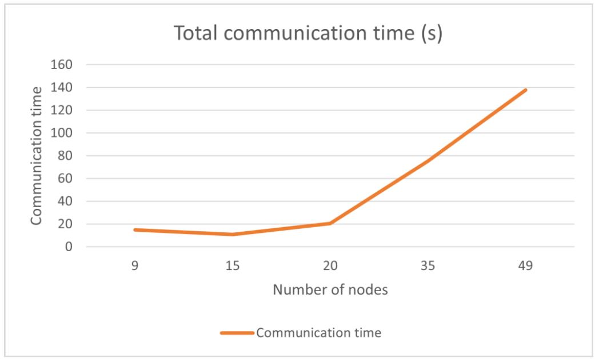

# Distributed Earthquake Detection

**The goal of this project is to simulate earthquake detection in a distributed wireless sensor network (WSN) with message passing using MPI and POSIX threads in C.** 

The architecture of the WSN is shown in the image below wherein seismic sensors are geographically distributed in an $n\times n$ cartesian grid layout.

<p align="center">

</p>

To counter against false positives, when a single sensor detects a potential earthquake it requests readings from neighboring sensors (top, down, left, right sensors within the grid). If all nearby sensors also detect a potential earthquake within a certain (latitude, longitude) from each other with similar magnitude, only then will a message be sent back to the base station which then double checks the readings of a balloon seismic sensor. If the report and the aerial seismology results match within a certain threshold, the earthquake is confirmed and is logged by the base station with as much as detail as possible (the time, estimated location, and all sensor readings associated with the detected earthquake). This monitoring continues endlessly until the user manually ceases its operation.

The technical implementation of this distributed architecture is illustrated in the diagram below:

<p align="center">

</p>


## Seafloor Seismic Sensors

### Operations

Within the Cartesian topology, each node obtains their rank as well as their neighbors' ranks, which are stored in a global array so that the neighbor communicator thread can access it.

Each node then spawns a thread to handle communication with adjacent nodes and enters a loop which repeats until they are killed off by the Base station. The flowcharts below illustrate the operations of interest which occurs during the loop for the main sensor node and the spawned neighbor communicator thread:

<p align="center">

</p>

As you can see, the two threads have distinct responsibilities:
- Main sensor
    - Generates random sensor readings (to simulate noisy seismic readings)
    - If potential earthquake is detected, it toggles a flag, `request_from_neighbors` which lets the neighbor communicator know that it wants to collect neighbor readings.
    - Compare with neighbor readings, if ≥2 matches it sends an alert to the base station
- Neighbor communicator
    - Checks for incoming request signals and fulfills them (in `check_requests()`)
    - If the main sensor has requested for neighbors’ readings, this thread sends non-blocking request signals and sets up non-blocking receives for neighbor readings which are then stored in a global array.

### Design

Our design focus is operational efficiency; therefore all message passing is performed asynchronously as it incurs the least amount of delay in operations (for example, what if we missed a potential earthquake while waiting to communicate?).

We achieve this by strictly using non-blocking functions: `MPI_Isend`, `MPI_Irecv`, and `MPI_Testall`. With this in mind, several important design decisions are highlighted below:

#### Why use a mutex lock (`reading_mutex`)?

This lock exists to prevent sensor readings from the previous iteration to be overwritten, if those readings indicated a potential earthquake, while the thread is *still* collecting neighbor readings, it may cause mismatch during comparison. See the figure below which illustrates a scenario wherein there is a delay in obtaining neighbor readings and, if no mutex lock is implemented, once the readings have been collected the original reporting node's readings have been overwritten.

<p align="center">

</p>

#### `check_requests`

This function is responsible for asynchronously handling incoming requests. The algorithm for this is given below:

```c
MPI_Iprobe(MPI_ANY_SOURCE, 1, cart_comm, &send, &status); 
while(send) { 
    MPI_Recv(&sender,1,MPI_INT,status.MPI_SOURCE,1,cart_comm,MPI_STATUS_IGNORE); 
    MPI_Isend(reading, 1, reading_mpi_type, sender, 0, cart_comm, &send_request); 
    send=0; 
    MPI_Iprobe(MPI_ANY_SOURCE, TAG_READING_REQUEST, cart_comm, &send, &status); 
}
```

As you can see it uses MPI_Iprobe to perform a non-blocking check for incoming messages with tag=1 (request tag). If it detects an incoming signal, it receives the request, and performs a non-blocking send of its readings. We do not need to perform a Wait because it is not required for the neighbor’s readings to be synchronized with the requesting node.

#### Why does the neighbor communicator perform `check_requests()` and `MPI_Testall` in a loop?
After sending out the non-blocking sends and non-blocking receives to the node’s neighbors, the thread then executes the following loop:

```c
while(!complete && alive) { 
    is_alive(); 
    check_requests(cart_comm, reading_ptr, reading_mpi_type, cart_rank); 
    MPI_Testall(NNEIGHBORS, recv_requests, &complete, recv_statuses); 
}
```

- It checks whether it is alive to ensure that the node does not get stuck waiting for a response from a dead node
- `check_requests()` prevents deadlock condition by checking for any incoming request signals and fulfilling them
- `MPI_Testall` is used to perform a non-blocking check on whether the non-blocking messages have been completed. `MPI_Waitall` is not used here because of the possibility of a deadlock as illustrated in the figure below where every adjacent node is requesting from each other.
- 
<p align="center">

</p>

## Base Station

The base station is a single node with a separate communicator than the sensor nodes. It spawns a POSIX thread representing the balloon seismic sensor which runs in parallel with the base station.

### Operations

Before entering its main loop, the base station:
- creates a shared global array
- Creates the sentinel file “rec_sentinel.txt”
- Initializes the mutex lock
- Spawns a thread (balloon seismic sensor)
During the main loop, its processes are illustrated with the flowchart below:

<p align="center">

</p>

As you can see, the base station periodically (every 1s) performs a non-blocking check with `MPI_Iprobe` and if there is an incoming message from a sensor node, i.e. an alert, then it proceeds to compare the reporting node’s readings with the readings of the balloon sensor. If it matches, a conclusive report is logged otherwise an inconclusive one is reported.

## Balloon Seismic Sensor

The balloon seismic sensor is a spawned POSIX thread from the base station node which is running in parallel to the base station.

### Operations

It shares a global array with the base station and it performs the majority of its operations within a loop which is illustrated in the flowchart below:

<p align="center">

</p>

As you can see its main responsibility is periodically generating sensor readings and writing them to the shared array.

### Design

This shared array is a circular array whereby if we reach the end of the array, the index loops back around to 0 and we replace the oldest stored reading, i.e. FIFO.

#### Why is a mutex lock used?

Since the balloon writes to the shared array and the base station reads from the shared array, the mutex lock is used to ensure that only one thread has access to the array at any given time. This prevents race conditions.


## Results

If we increase the dimensions of the cartesian grid, the higher the probability of a report occurring which we do observe as shown in the graph below:

<p align="center">

</p>

Of course as the number of nodes increased, the more message passing occurs and the more time is spent communicating. However, due to the efficient asynchronous message passing design, the increase in communication time is relatively small (take for example from 15->20, an increase of 5 nodes only adds 3 seconds to total communication time for 50 iterations.) 

<p align="center">

</p>
